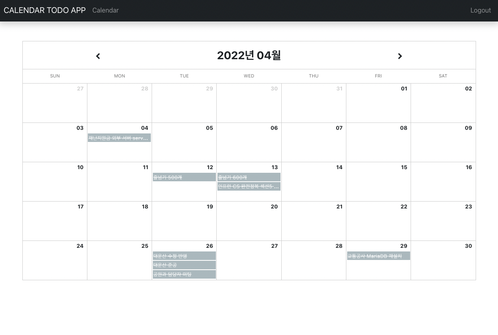
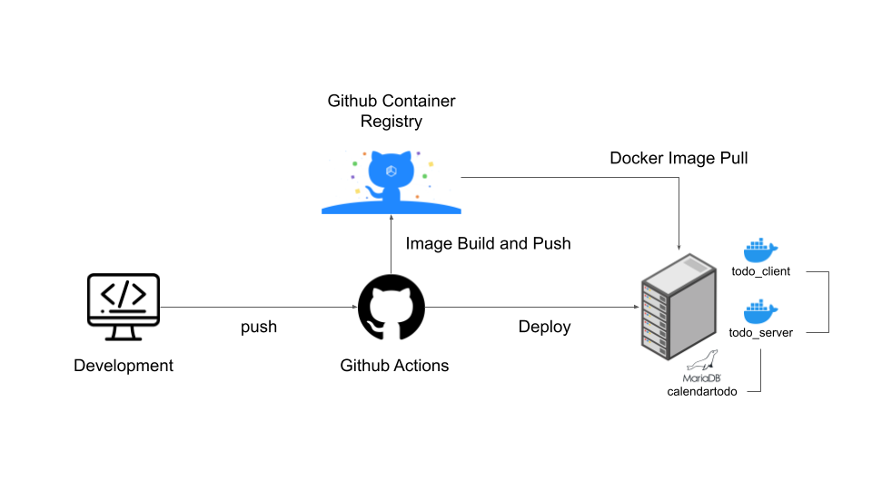

# calendartodo application

## Running locally without Docker
```
git clone git@github.com:nicejongwoo/spring-react-calendar-todo.git
```
### BackEnd
```
./mvnw spring-boot:run -Dspring.profiles.active=local
```
### FrontEnd
```
cd ./front-end
npm install -g yarn
yarn
yarn start
```

## Running locally with Docker
### docker compose running
```
docker-compose up -d
```
### docker compose stop && remove volume
```
docker-compose stop
docker-compose down -v
docker volume prune
```

## Connection service
- http://localhost:9090


**Architecture diagram of the Spring Petclinic Microservices**


